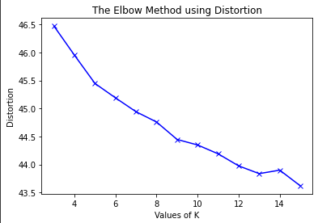
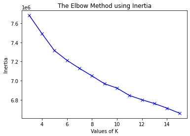
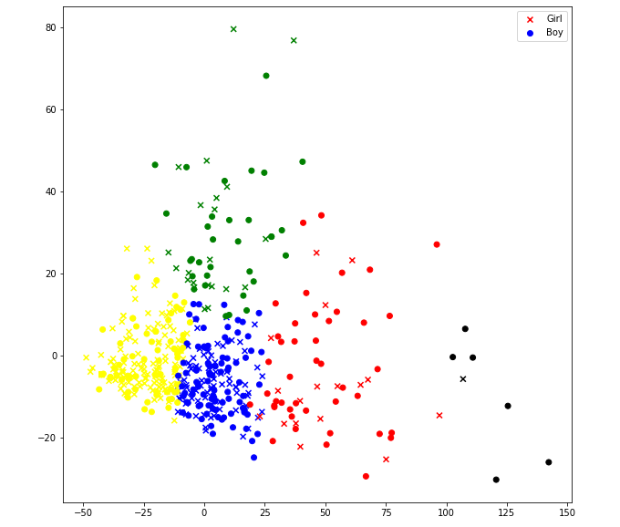
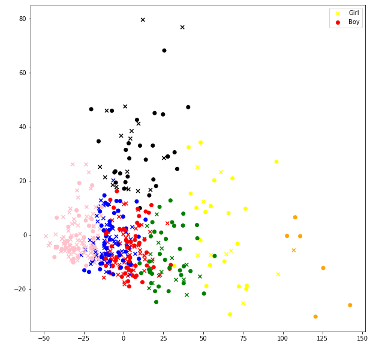
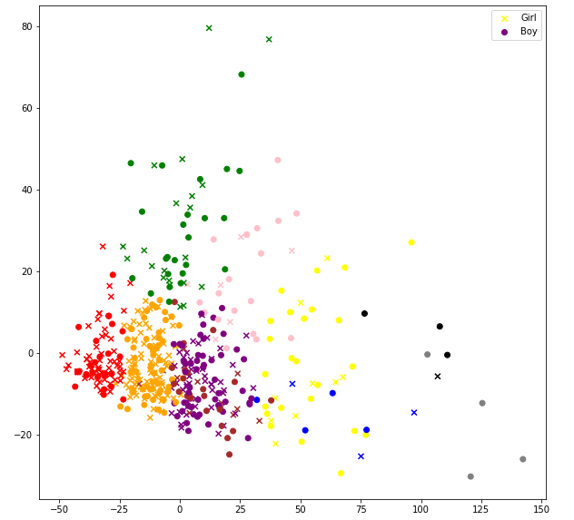
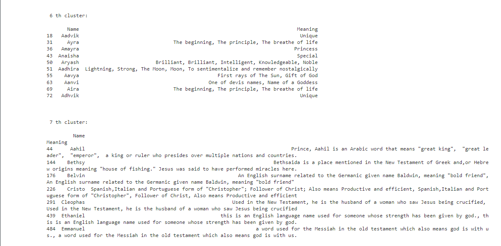

# Natural Language Processing (NLP) | Self Project

In this project, I have have scraped few baby names from the website [firstcry](https://parenting.firstcry.com/baby-names/) and applied K-Mean clustering algorithm to cluster names according to their meanings. I have further used PCA to reduce dimentions and plot the clusters for visualisation.

## Libraries used
1. Requests
2. Beautiful Soup
3. NLTK
4. NumPy
5. Pandas
6. Scikit-Learn
7. matplotlib

## Overview of What I did
1. I used requests and beutiful soup to scrap baby names along with their gender and meanings from [firstcry](https://parenting.firstcry.com/baby-names/). Since there were too many names. I scraped all the baby names till the alphabet E and stored the data in .txt files which can be seen in Baby Names file.

2. Then, I went on with the analysis part but first, I needed to clean and organise the data before I proceed to calculating the Term Frequenct-Invrse Document Frequncy(TF-IDF).
 -First I separated the name, gender and meaning from the file, while removing portions of data which had garbage value. 
 -Then I converted all the alphabets in meanings to lowercase and using NLTK removed punctuations and stopwords which have no significance to the meanings.

3. The next step was calculating TF-IDF. I used the following formula to calculate TF-IDF :
	tf idf(t,d,D) = tf(t,d) * idf(t,D)

	tf(t,d) = log(1 + freq(t,d))
	idf(t,D) = log~10~(M / count(D,t))

	where, freq(t,d) is the frequency the word t in documed d
	       count(d,t) means how many documents has the word t appeared in all documents D
	       M = total number of words
   TF-IDF tells us how relevant a word is with respect to the document.

4. To find relationship between the name meaning I normalised all meanings using GloVe word embeddings to get 100-D word normalised word vectors.

5. Used Elbow algorithm to find the optimal number of clusters.

	Elbow Method with Distortion
 	

 	Elbow Method with Inertia
 	

 	Here the optimal number of clusters is 7

6. Applied KMeans from scikit learn to create clusters of size 5,7 and 10 and reduced their dimentions to visualise them.

	5 Clusters
	

	7 Clusters
	

	10 Clusters
	

## Conclusion

We were able to see the clusters and below is an example of a pattern in 2 cluster of the 7-Cluster 

